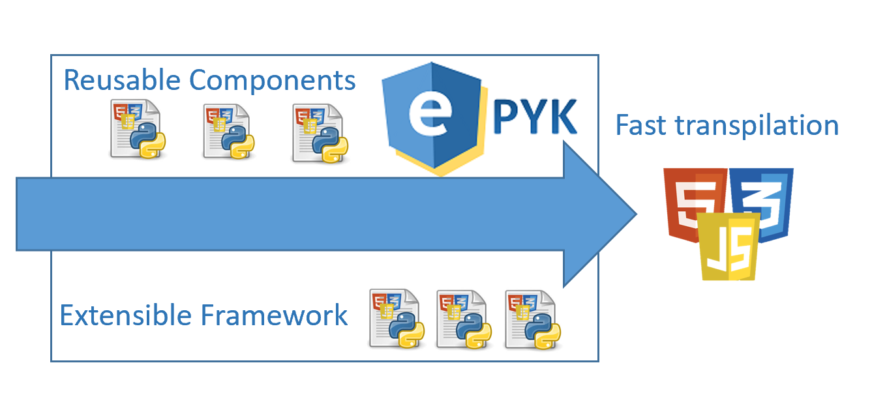
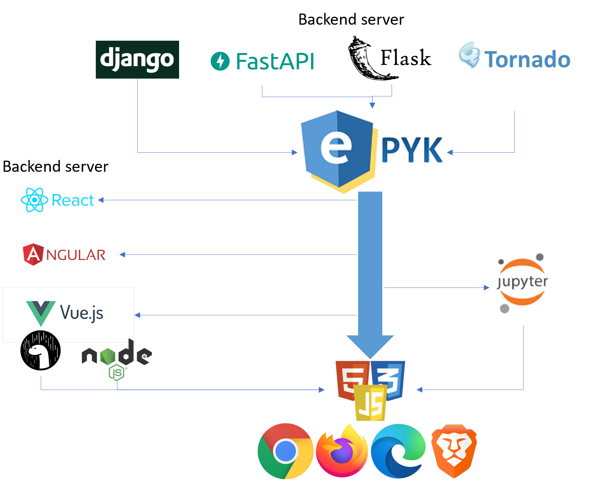
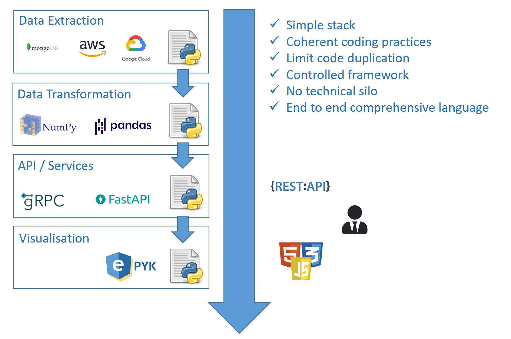
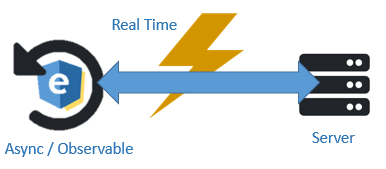

A module to link Python ecosystem to the JavaScript one.

Presentation
================================
The goal of Epyk is to ensure the implementation of a coherent system using a minimum of layers.
With Epyk the user stays in the Python layer to drive and optimize the data transformation.
This Framework also encourages the implementation of Micro services and cloud based architecture.




Compatibility
================================

Epyk is compatible with the most common Web Python Frameworks (Flask and Django).
By default, the server package embeds a Flask app as it is easier to install and ready to use.

The Framework can be included within a Jupyter or JupyterLab project. But this will lead to some limitations - for example Ajax and Socket will not be available.

Web pages generated are compatible with the common modern web frameworks



But the target is to be full stack developers and be flexible enought to integrate our UI pages to any existing ecosystems.
Thus some outs features are available to wrap page to be visible on any server

This encourage the collaboration and break the IT silos. It can fully work in an Agile way of working as developers, business analysts, product owners and users can work on the same stack 
and improve directly the final product. Any work done on the side within Jupyter or standalone Python scripts can be easily integrated !



Examples are available for some web servers:

In Python
- [Tornado](https://github.com/epykure/epyk-tornado)
- [Flask](https://github.com/epykure/epyk-flask)
- [Django](https://github.com/epykure/epyk-django)
- [Uvicorn](https://github.com/marlyk/epyk-uvicorn)

In JavaScript, TypeScript or Rust
- [Angular](https://github.com/epykure/epyk-angular) 
- [Vue]()
- [React](https://github.com/epykure/epyk-react)
- [Node](https://github.com/epykure/epyk-nodejs)
- [Deno]()

Usage
======

First install Epyk to your Python environment

```py
pip install epyk
```

Create a report and change CSS3 or add JavaScript events

```py
from epyk.core.Page import Report

page = Report()
page.headers.dev()

button = page.ui.button("Click me")
button.style.css.color = "red"
button.click([
    page.js.console.log("log message")
])
.... 

page.outs.html_file(path="/templates", name="test")
```

Go to the next level and add real time flux in few lines or code.



On the client side
```py
page = Report()
page.headers.dev()

socket.connect(url="127.0.0.1", port=3000, namespace="/news")
input = rptObj.ui.input()

pie = rptObj.ui.charts.chartJs.polar([], y_columns=[1], x_axis="x")

container.subscribe(socket, 'news received', data=socket.message['content'])
pie.subscribe(socket, 'news received', data=socket.message['pie'])

rptObj.ui.button("Send").click([
  socket.emit("new news", input.dom.content)
])

page.outs.html_file(path="/templates", name="socket_example")
```


On the server side (using socketio)
```py
from flask import Flask, render_template_string
from flask_socketio import SocketIO, emit

app = Flask(__name__)

app.config['SECRET_KEY'] = 'secret!'
socketio = SocketIO(app)

 
@socketio.on('new news', namespace='/news')
def new_news(message):
  values = getSeries(5, 100)
  result_pie = chart_data.chartJs.y(values, [1, 4, 5], 'g')
  emit('news received', {"content": message, 'pie': result_pie}, broadcast=True)

```

Export the result in a local HTML page. More example are available on the [official repository](https://github.com/epykure/epyk-templates)

More example are available on Github or in [Jupyter](https://nbviewer.jupyter.org/github/epykure/epyk-templates-notebooks/blob/master/index.ipynb)

Please get in touch if there is any feature you feel Epyk-UI needs.
