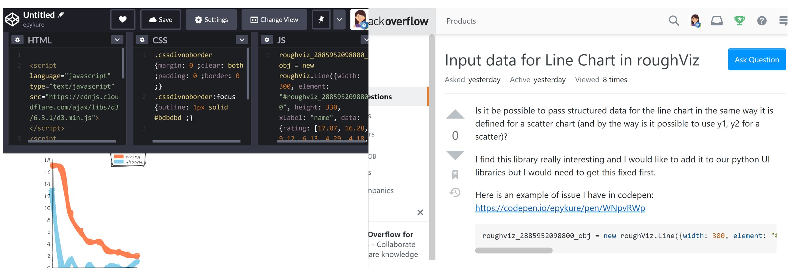
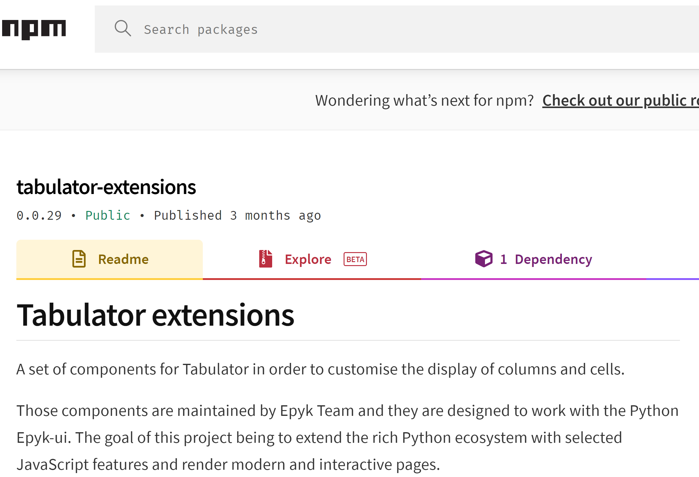

A design for the web
====================

Epyk is fully integrated to the web ecosystem and it is main target is to simplify the step from Python.

Python is becoming a very popular language nowadays and it is sometimes quite complicated to move to other technologies.

Epyk should be the right perfect library to deal with concept easily but also thanks to the documentation, structure and functions names
to learn and get the good practices.

Be an actor
***********

By using Epyk, it will be possible to create rich and interactive web content from the most popular libraries but it will
also allow you to use those UI tools to communicate, provide feedback and ask for new features. Thus you will be able to point a bug
or mention a nice feature missing a library.

Ask a question in Stack overflow with Codepen examples
_______________________________________________________

Epyk structure will allow you to isolate a component or a feature, generate the web content to the desired formant and then
check the result (and potentially adapt).

For example the below Stack overflow request will be there to ask for a change or details on a recently introduced Charting library:

1. Isolate the component and illustrate the problem in a report::

    import epyk as pk

    page = pk.Page()
    languages = [
        {"name": 'C', 'type': 'code', 'rating': 17.07, 'change': 12.82},
        {"name": 'Java', 'type': 'code', 'rating': 16.28, 'change': 0.28},
        {"name": 'Python', 'type': 'script', 'rating': 9.12, 'change': 1.29},
        {"name": 'C++', 'type': 'code', 'rating': 6.13, 'change': -1.97},
        {"name": 'C#', 'type': 'code', 'rating': 4.29, 'change': 0.3},
        {"name": 'Visual Basic', 'type': 'script', 'rating': 4.18, 'change': -1.01},
        {"name": 'JavaScript', 'type': 'script', 'rating': 2.68, 'change': -0.01},
        {"name": 'PHP', 'type': 'script', 'rating': 2.49, 'change': 0},
        {"name": 'SQL', 'type': 'script', 'rating': 2.09, 'change': -0.47},
        {"name": 'R', 'type': 'script', 'rating': 1.85, 'change': 0.90},
      ]
    b = page.ui.charts.roughviz.plot(languages, y=["rating", 'change'], x='name', width=300)

2. Use a specific outputs to generate Codepen files::

    page.outs.codepen()

This will create to the root directory an output files with 3 files corresponding to the different Codepen boxes.
Copy paste the content, save your work and create a question in Stack Overflow.

2. Add extra feature to enrich an existing library
__________________________________________________

In the same way it is possible to create and propose change to existing libraries. For example for Tabulator we create a
module dedicated to enrich the number of existing Formatter, Aggregator and Mutator to ease the configuration for
anybody using this library.

All Codepen source codes used to create the stack overflow requests are available `here <https://github.com/epykure/epyk-templates/tree/master/codepen>`_

