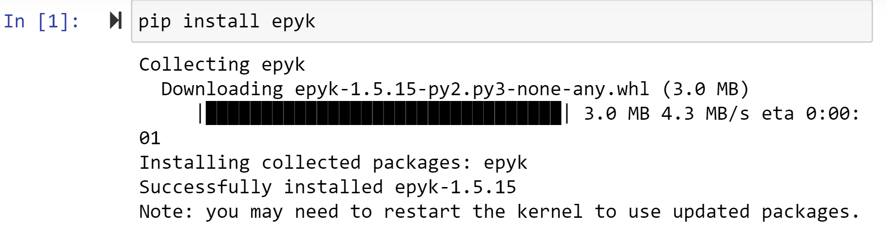

Epyk with Jupyter
=================

Epyk can be used either with a local instance of Jupyter or directly online from Jypyter Notebooks.

In this section we will provide online examples.

Start a project
***************

Go to `Jupyter <https://jupyter.org/>`_ and start a Python project.

Add Epyk to your online notebook

Let's start with a simple cell and a slider component::

    import epyk as pk

    page = pk.Page()
    slider = page.ui.slider()
    text = page.ui.text(0)
    slider.change([
        text.build(slider.dom.content)
    ])
    page.outs.jupyter()

.. image:: ../_static/jupyter_2.PNG
    :align: center

We can add tables to this notebook::

    import epyk as pk
    from pandas_datareader import data as pddr

    data = [
        {"x": "label 1", "y": 23, "y2": 53},
        {"x": "label 2", "y": 10, "y2": 26},
    ]
    page = pk.Page()
    title = page.ui.title("Data Reader")
    s = pddr.DataReader("BAC", 'yahoo', "2021-04-01", "2021-04-20")
    page.ui.tables.datatable(s.to_dict(orient="records"), cols=['Close'])
    page.outs.jupyter()

More example should be provided soon in this section.

You can also refer to the previous examples created to show case the concept of `Epyk <https://nbviewer.jupyter.org/github/epykure/epyk-templates-notebooks/blob/master/tutorials/components/00_components.ipynb>`_

