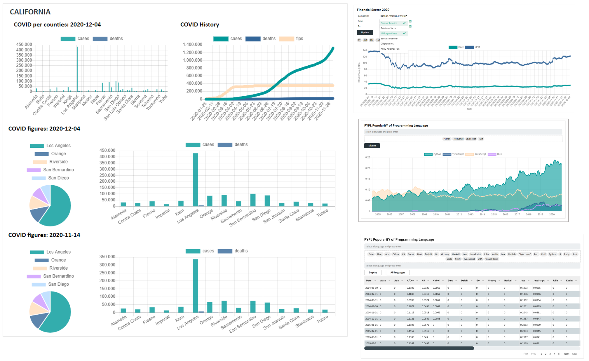
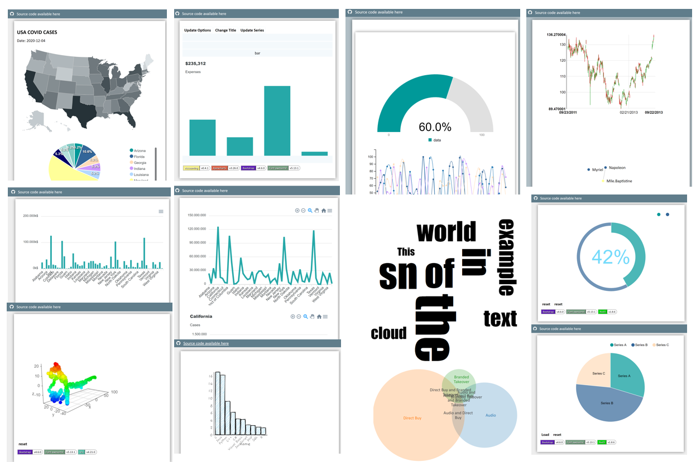

Welcome to
================================

.. image:: _static/epykIcon.PNG
    :alt: Epyk: HTML/JS Development in Python
    :align: center
    :width: 200
    :target: https://github.com/epykure/epyk-ui

Presentation
================================
The target of Epyk is to ensure the implementation of a coherent system using a minimum of layers.
With Epyk the user stays in the Python layer to drive and optimize the data transformation.
This Framework also encourages the implementation of Micro services and cloud based architecture.

This package will allow you to easily create rich and interactive web interfaces to your projects.

**No JavaScript, CSS or HTML5 knowledge needed, the platform will provide you the best experience thanks to the community.**

Compatibility
================================

Epyk is compatible with the most common Web Python Frameworks (Flask and Django).
By default, the server package embeds a Flask app as it is easier to install and ready to use.

The Framework can be included within a :doc:`jupyter/Jupyter` or :doc:`jupyter/JupyterLab` project. But this will lead to some limitations - for example Ajax and Socket will not be available.

Community & Support
===================

Epyk is an **OpenSource** module dedicated to provide functions and components to improve the productivity.
Do not hesitate to participate in improving the library.

Any help are welcome and this can be done by JavaScript developers interesting to learn Python or by Python developers.

Also please do not forget to star our project on `Github <https://github.com/epykure/epyk-ui>`_ or to
follow us on `Twitter <https://twitter.com/Epykure1>`_ or on `LinkedIn <https://uk.linkedin.com/in/epykure-python-58278a1b8>`_ to get the latest news.

Examples
================================

You can find examples of what Epyk can do right here:

- `Components <https://github.com/epykure/epyk-templates/tree/master/locals>`_
- `Dashboards <https://github.com/epykure/epyk-templates/tree/master/tutos>`_
- `Websites <https://github.com/epykure/epyk-templates/tree/master/websites>`_
- `Jupyter Playground <https://nbviewer.jupyter.org/github/epykure/epyk-templates-notebooks/blob/master/tutorials/components/00_components.ipynb>`_

Also get online demo from the `Epyk Gallery <https://epykure.github.io/demos/>`_

Coming Soon
================================

Please see below the 2021 road map of notifications on Twitter:

.. raw:: html

    <ul>
        <li><del>W13:  Dashboards</del><a href="./weeks/w13.html">  [+ details]</a></li>
        <li><del>W14:  Web sites, UX / UI Development</del><a href="./weeks/w14.html">  [+ details]</a></li>
        <li><del>W15:  Epyk for Data Science</del><a href="./weeks/w15.html">  [+ details]</a></li>
        <li><del>W16:  Epyk and Backend Servers (Fast API)</del><a href="./weeks/w16.html">  [+ details]</a></li>
        <li><del>W17:  Epyk documentation I</del><a href="./weeks/w17.html">  [+ details]</a></li>
        <li><del>W18:  Epyk documentation II</del><a href="./weeks/w17.html">  [+ details]</a></li>
        <li><del>W19:  Epyk & Jupyter</del><a href="./weeks/w18.html">  [+ details]</a></li>
        <li><del>W20:  Gallery and Demos</del><a href="https://epykure.github.io/demos/">  [+ details]</a></li>
        <li><del>W21:  Gallery and Demos</del><a href="./weeks/w21.html">  [+ details]</a></li>
        <li>W22:  Epyk Studio</li>
        <li>W23:  Epyk with web framework (Vue, Angular or React)</li>
        <li>W24:  Crypto Currency tracker with Epyk</li>
    </ul>

Do not hesitate to follow us on `Twitter <https://twitter.com/Epykure1>`_ or to help us improving our code by
sending pull requests on `Github <https://github.com/epykure/epyk-ui>`_ !

.. toctree::
    :maxdepth: 5
    :hidden:

    intro/getting-started-with-epyk.rst
    intro/first-pages.rst
    intro/ready-to-use.rst
    intro/getting-started-with-webdev.rst
    intro/design-architecture-details.rst
    intro/security-control.rst
    intro/advanced-features.rst
    intro/external-packages.rst
    intro/extensions.rst
    intro/bugs_todo.rst
