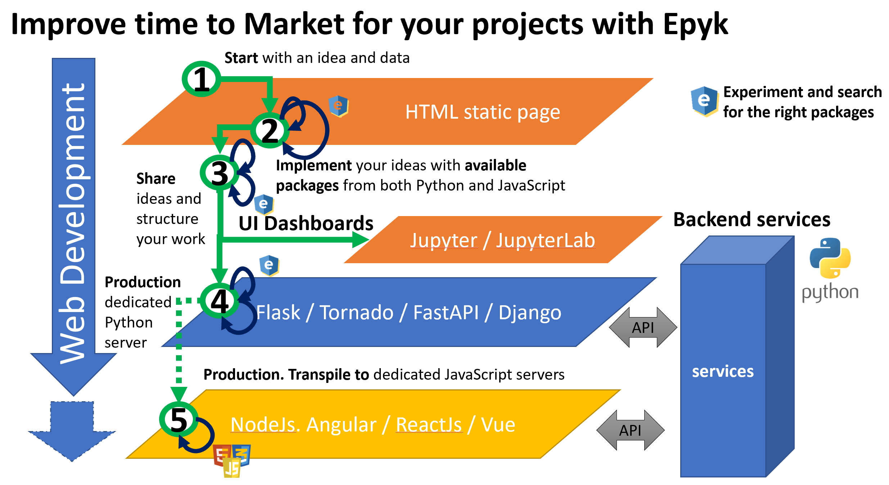
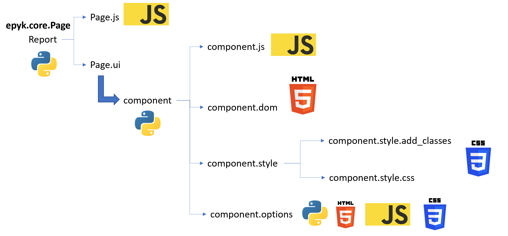
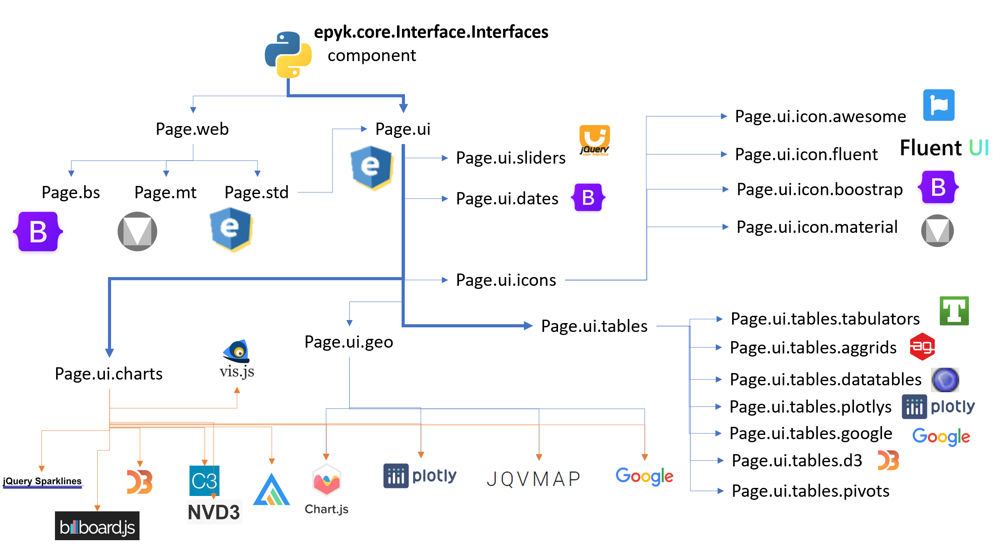
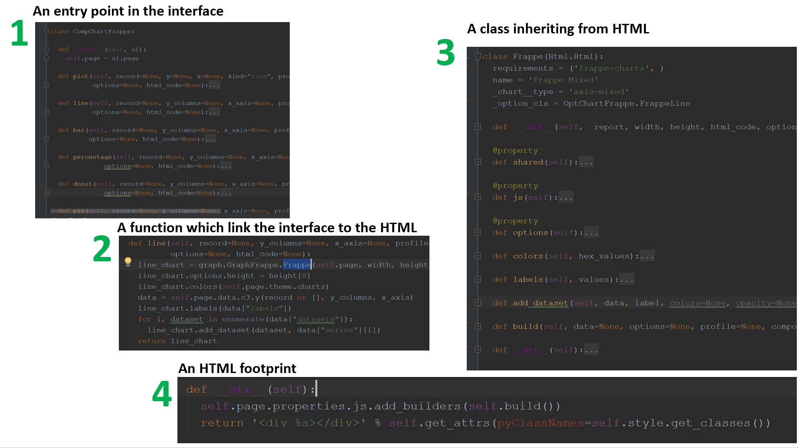
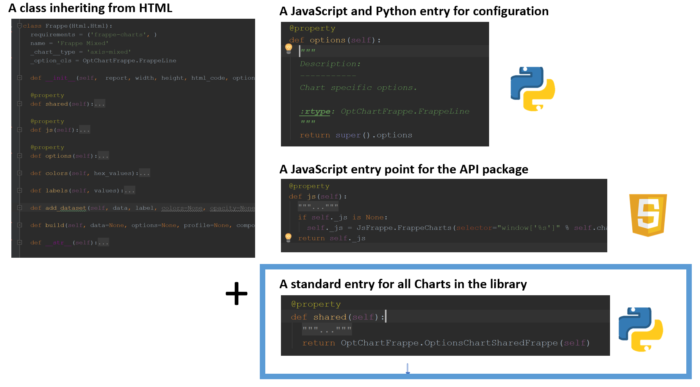
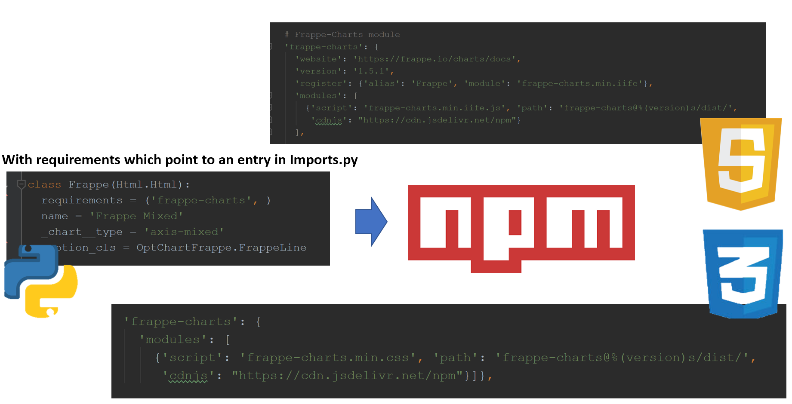
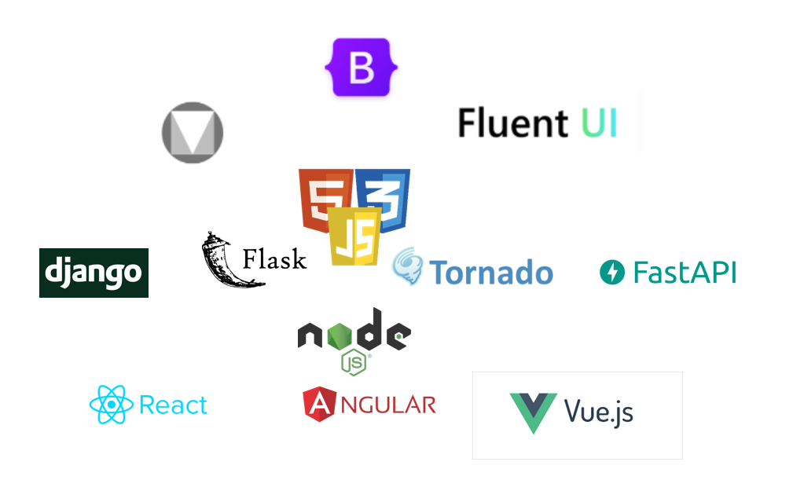
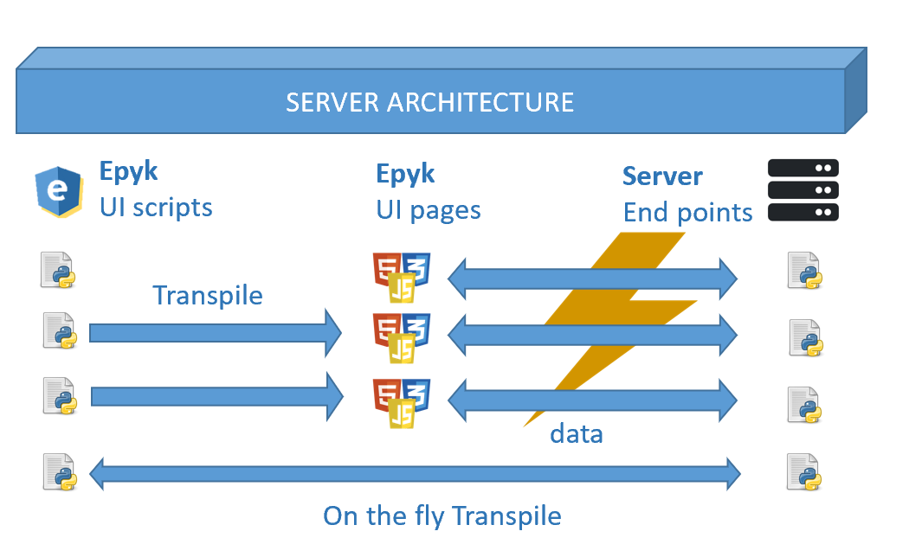

Design & Architecture
=====================

Architecture
************

Page
####

From the page object it is possible to get all the entry points

The page object will also have dedicated properties to simplify the link with Python modules.

Components
##########

HTML Component
##############

The below sections details the work required to add an new HTML component to the framework.
Frappe-Charts will be used as reference here:

First the creation of teh key modules for the page object:

- An interface in the interface component: CompChartsFrappe.py
- An HTML component page: GraphFrappe.py

This will make the component available from the `page.ui` property

After to add interactivity and configuration for this components two extra modules are required:

- A dedicated modules for the component (Js, Py and Css) options: OptChartFrappe.py
- A module to wrap the external library API: JsFrappe.py

Those modules will have link to the online documentation of the different functions in order to provide further details and
examples.

Also most of the functions are exactly the same than the ones defined in the API to simplify the communication between developers.

Then if some external module is required to build the component those are defined from the npm alias in the requirements class
variable.

This will point to two references in the `Imports.py` module one for the JavaScript and the other one for the CSS.
Imports.py is the module used to add the external files to the page. It will manage the dependencies between configurations and the version of the packages.

Common API to easy the migration
********************************

The spirit of the framework is to benefit from the rich ecosystem but to not be attached to one library or framework.
Thus there is a common API for components to easy this transition.

For example for charts::

    import epyk as pk

    url_data = "https://raw.githubusercontent.com/vega/datalib/master/test/data/stocks.csv"

    page = pk.Page()

    data = page.py.requests.csv(url_data)
    formatted_data = []
    agg_data = {}
    for rec in data:
        agg_data.setdefault(rec["date"], {})[rec["symbol"]] = float(rec["price"])
        agg_data[rec["date"]]["date"] = rec["date"]
    chart = page.ui.charts.chartJs.bar(list(agg_data.values()), y_columns=["MSFT", "AMZN", "IBM"], x_axis="date")
    page.outs.jupyter()

.. note::
  Specific ``.options`` or ``.js`` functions will not be necessarily compatible between libraries.
  We are introducing the concept of `.shared` properties to solve this issue.

Collaborative platform
**********************

The main target of this library is to allow a smooth move from Python to JavaScript but also for the JavaScript developers
to bring their knowledge in order to provide better integration and performances to the transpiled results.

By using Epyk and improving this layer, Python developers will be able to test JavaScript code and provide quick feedbacks.
In the same way they will be able to produce web results which could be easily integrated to the IT stack.

To achieve this Epyk is implemented to be compatible with the current UI libraries and the most popular framework.

*Integration to JavaScript web framework is still in progress on this.*

Full stack development
**********************

Epyk ensure a full stack development and also it will guarantee that your front end will benefit from the community updates.
Indeed this library is used for producing a configurable UI build from pre defined JavaScript and CSS definition, it the structure
or the code as changed on the component side a simple update of the library and a new transpiling of the script will render
better web pages.

It will also help you upgrading your packages in a safe manner. Indeed by using the `shared` property, this will guarantee
that despite the changes performed in the packages this will remain unchanged.

Data Driven Design Architecture
*******************************

This is the main concept which lead the implementation of Epyk. We realised that most of the users were familiar with Python hence
were able to write algorithms but they were always blocked to promote and share their work easily.

Quite a few great proprietary platform (Tableau, Power BI, DataIku...) offer this service but we wanted to have something free and flexible enought to go to the last
stage which is the integration to existing web Ecosystems.

Other related topics
********************

.. toctree::
    :maxdepth: 1

    /guides/integrated-to-web.rst
    /report/supported_ext.rst
