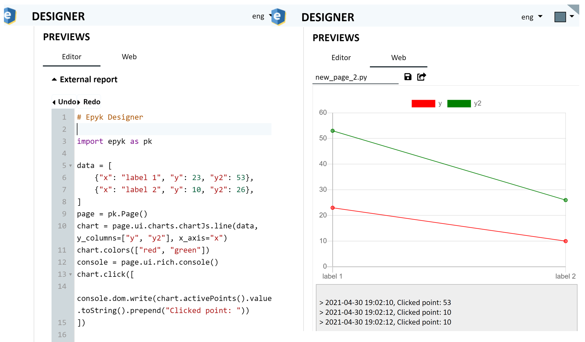
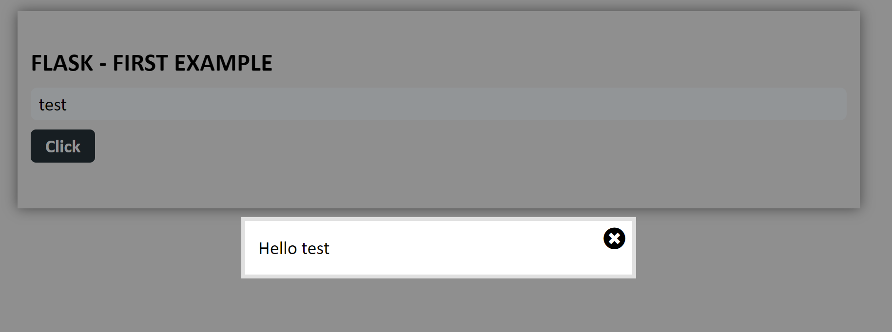
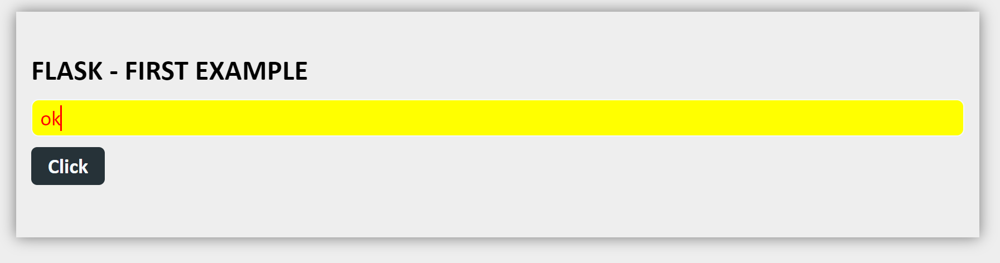
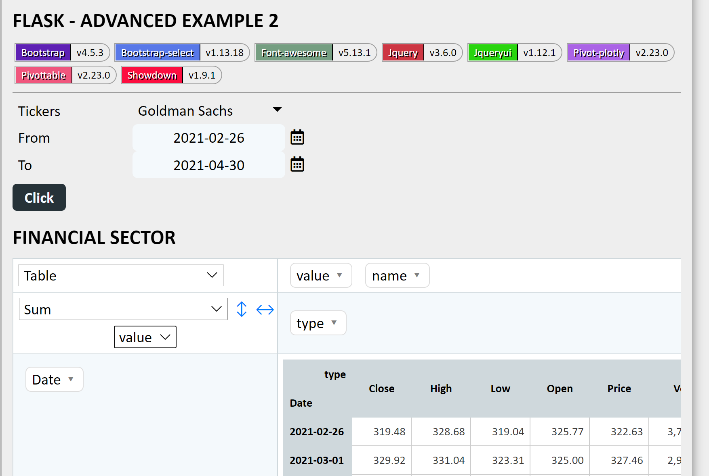

First Pages with Epyk
=====================

It is possible to implement simple static page to rich and interactive ones.
Epyk will provide interfaces to components and events which can be used as an simple interface to a model or data source
to a more complex ones interacting with any backend servers.

.. warning::
   The line ``page.outs.jupyter()`` need to be added to run in online Jupyter notebooks.

Step-by-step
************

Simple Page
###########

Let's start with simple chart with the hard coded values, to do so we will add components available to ``page.ui``::

    import epyk as pk

    data = [
        {"x": "label 1", "y": 23},
        {"x": "label 2", "y": 10},
    ]
    page = pk.Page()
    page.ui.charts.chartJs.line(data, y_columns=["y"], x_axis="x")

.. note::
    By convention common components are attached directly to the ``page.ui`` property.

    Plural names are used by convention to provide different flavour of them ``page.ui.fields``

Changing style
##############

The below will change the color of the lines::

    import epyk as pk

    data = [
        {"x": "label 1", "y": 23, "y2": 53},
        {"x": "label 2", "y": 10, "y2": 26},
    ]
    page = pk.Page()
    chart = page.ui.charts.chartJs.line(data, y_columns=["y", "y2"], x_axis="x")
    chart.colors(["red", "green"])

Adding events
#############

This will create::

    import epyk as pk

    data = [
        {"x": "label 1", "y": 23, "y2": 53},
        {"x": "label 2", "y": 10, "y2": 26},
    ]
    page = pk.Page()
    chart = page.ui.charts.chartJs.line(data, y_columns=["y", "y2"], x_axis="x")
    chart.colors(["red", "green"])
    console = page.ui.rich.console()
    chart.click([
       console.dom.write(chart.activePoints().value.toString().prepend("Clicked point: "))
    ])

Using external API
##################

This will create::

    import epyk as pk

    # Socket server url
    SERVER_SOCKET_HOST = "127.0.0.1"
    SERVER_SOCKET_PORT = 5000

    from flask import Flask
    app = Flask(__name__)

    def create_page():
      page = pk.Page()
      page.headers.dev()

      title = page.ui.title("Flask - First example")
      input = page.ui.inputs.left(placeholder="Enter your name", html_code="msg")
      button = page.ui.buttons.colored("Click")
      text = page.ui.text()
      simple_modal = page.ui.modals.popup([text])
      input.enter([button.dom.events.trigger("click")])
      button.click([page.js.post("/test_event", components=[input]).onSuccess([
        text.build(pk.events.data["message"]),
        simple_modal.dom.show()
      ])])

      box = page.ui.div()
      box.extend([title, input, button])
      box.style.configs.doc()
      return page

    if __name__ == "__main__":
      from flask import Flask, jsonify, request

      @app.route('/')
      def ui():
        return create_page().outs.html()

      @app.route('/test_event', methods=['POST'])
      def test_event():
        data = request.get_json()
        return jsonify({"message": "Hello %s" % data['msg']})

      Flask.run(app, host=SERVER_SOCKET_HOST, port=SERVER_SOCKET_PORT, debug=True)

In the above example it is possible to change all the CSS properties of the compontents.
For example, the below will change the color and the background color::

  input = page.ui.inputs.left(placeholder="Enter your name", html_code="msg")
  input.style.css.color = "red"
  input.style.css.background = "yellow"

Other use cases
***************

Epyk can be used to do more complicated dashboards with multiple events and interaction wiht the backend server.

Dashboards
##########

This one will get data from datareader and return the result to be then display in a pivotTable.
To insert those dependencies to the final web page it is only required to call those objects from the ui interfaces.

Thus we can find the below pieces in the code::

    ticker = page.ui.fields.select(
    cpns.select.from_dict(tickers_info), label="Tickers", multiple=True, html_code="ticker_value")

    ....

    pivot = page.ui.tables.pivots.plotly()

E-commerce
##########

Using standard IDE
******************

Epyk can be used in any IDE and it will provide autocompletion to simplify the implementation.

.. toctree::
    :maxdepth: 1

    /guides/python-ide.rst
    /guides/jupyter-epyk.rst

.. caution:: Include paths are relative to the file in the document project, not the file in shared content.
