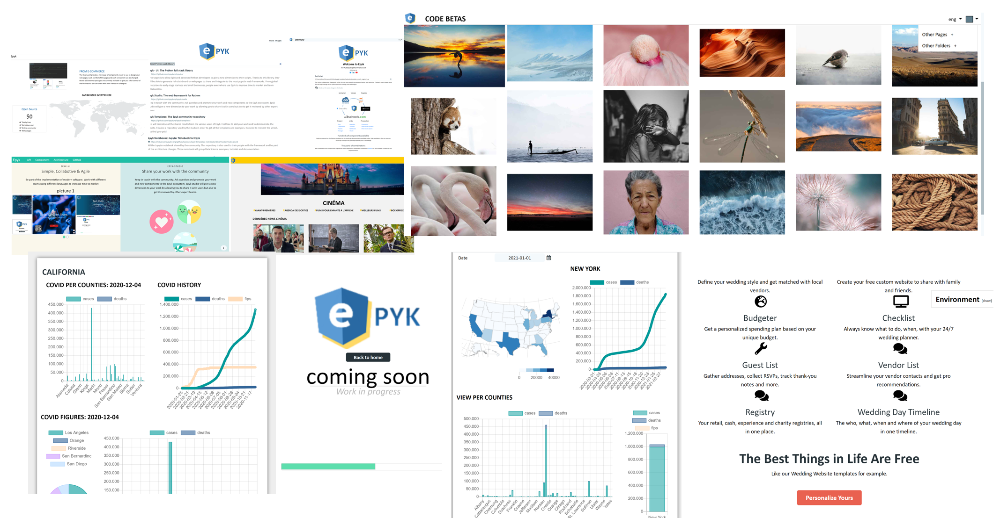
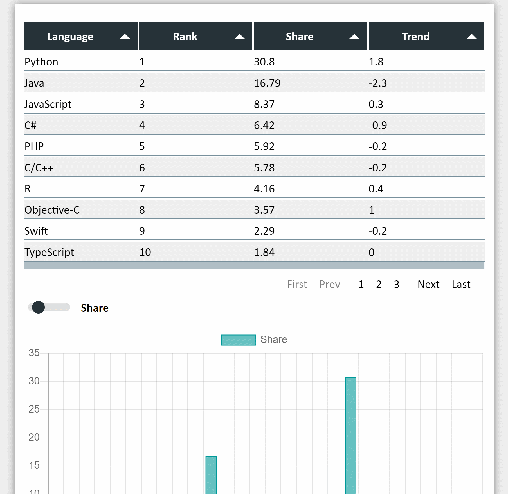
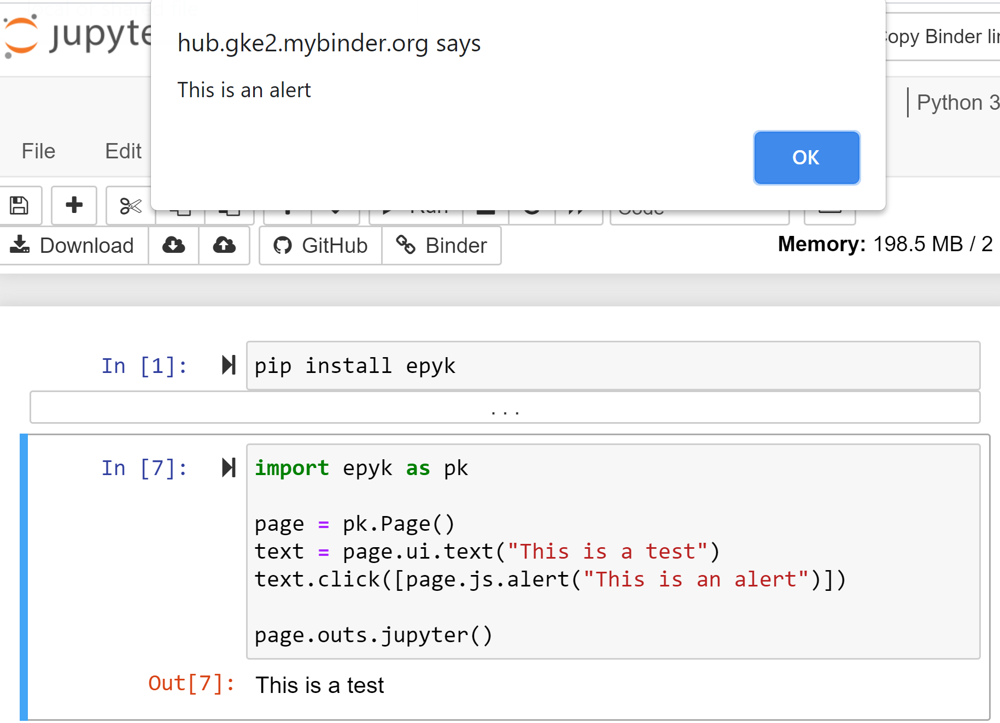
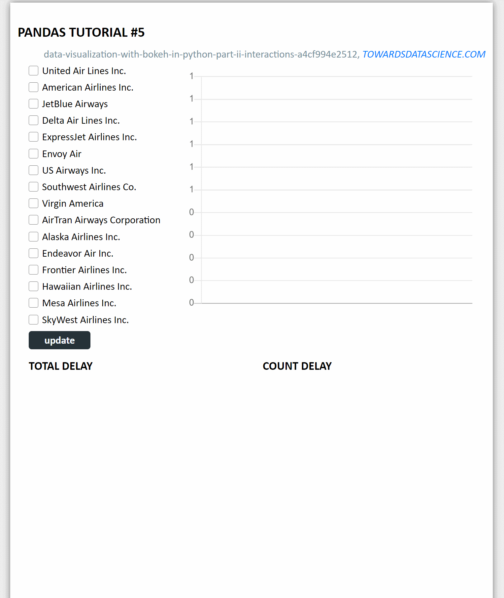

Getting started with Epyk
=========================

Epyk is designed for Python developers or users interested in implementing an entire product without having to change
technologies.

What is Epyk?
*************

Epyk is an OpenSource library designed to improve time to market for Data Scientists and any people eager to prototype
a new / or an extension to a product in a quite flexible manner.

The main targets of Epyk are to:

- Allow Python developers to present and share their work to users.
- Simplify the prototyping by using **components** and **templates**.
- Easy to start for beginners.
- Help to **ramp up with web technologies** by learning those concepts.
- Be used as a **web toolbox** to improve time to market and the learn web technologies.

Installation
************

Assuming you have Python already, install Epyk::

    pip install epyk

Create a directory inside your project to hold your ui and run the epyk-new command:::

    epyk.exe new

This command will create a first empty report in your folder.
Then the below command will convert (transpile) it to a web page::

    epyk.exe transpile

.. seealso:: More details on the :doc:`/report/cli`.

For a quick examples it is possible to use the below CLI::

    epyk.exe demo

Ths will generate the below script epyk_demo.py in the current directly::

    epyk.exe transpile -n=epyk_demo

This script will demo some common features available in the library::

    import epyk as pk

    # Module with mock data
    from epyk.tests import mocks

    # Create a basic report object
    page = pk.Page()
    page.headers.dev()

    page.body.template.style.configs.doc()

    # Change the CSS style of the div template container
    page.body.template.style.css.background = "white"

    table = page.ui.table(mocks.popularity_2020)
    table.options.paginationSize = 10

    toggle = page.ui.toggle({"on": "Trend", "off": "Share"})
    bar = page.ui.charts.bar(mocks.popularity_2020, y_columns=["Share"], x_axis="Language")

    toggle.click([
      # Store the variable to myData on the JavaScript side
      pk.std.var("myData", sorted(mocks.popularity_2020, key=lambda k: k['Language'])),
      # Use the standard build and dom.content to respectively update and get the component value
      pk.expr.if_(toggle.input.dom.content.toStr(), [
        # Use the variable to update the chart
        bar.build(pk.std.var("myData"), options={"y_columns": ["Trend"]})
      ]).else_([
        bar.build(pk.std.var("myData"), options={"y_columns": ["Share"]})
      ])
    ])

Another example is available in the `Github templates <https://github.com/epykure/epyk-templates/blob/master/tutos/onepy/flask_demo.py>`_ repo to illustrate how to adapt a script to backend services.
Very few changes are required to add a backend post to an underlying service::

  toggle.click([
    page.js.post("/data", components=[toggle.input]).onSuccess([
      bar.build(pk.events.data["chart_data"], options={"y_columns": pk.events.data["columns"]})
    ])
  ])

First Page
************

In Epyk the object used to create the final web page is called a `Page`.
The page object will be the one available to each component in charge of triggering the `.html()` on each components.

The unique page object will store all the components in a `page.components` dictionary. Each component will be in charge
of defining its JavaScript bindings, its HTML5 structure and also its need in external resources :doc:`guides/component-structure`.

Quick start
***********

The below will illustrate how to start with Epyk and build your first report.
This will write the web artifacts locally::

    import epyk as pk

    page = pk.Page()
    text = page.ui.text("This is a test")
    text.click([page.js.alert("This is an alert")])
    page.outs.html()

the last line `page.outs.html()` is important since it will produce the final web files which can be used in a browser.
It will be very often not mentioned in the examples because this can vary according to the framework used.

In the below example `page.outs.jupyter()` is used instead to render the example from an online session of Jupyter notebook.

Also this is not needed if you use the :doc:`../report/cli` to render the page.

The best to get more familiar with Epyk is to use PyCharm and the code autocompletion or to start
with examples on the template `Github repository <https://github.com/epykure/epyk-templates>`_

Web Development
***************

From Epyk it is possible to interface any Python project using any Backend technology.
It can be used like Jinja to render rich HTML content on the fly.

The below example illustrate how to generate an interactive dashboard with few lines of codes and without any server::

    page = pk.Page()
    #page.theme.color_palette("brewer.PuBu8")

    # Set the page layout
    template = page.body.add_template(defined_style="doc")
    template.style.css.background = page.theme.greys[0]

    page.ui.title("Pandas tutorial #5")
    page.ui.texts.references.website(url="https://towardsdatascience.com/data-visualization-with-bokeh-in-python-part-ii-interactions-a4cf994e2512")
    source_data = "https://raw.githubusercontent.com/WillKoehrsen/Bokeh-Python-Visualization/master/interactive/data/complete_flights.csv"

    df = pd.DataFrame(page.py.requests.csv(source_data, store_location=r"C:\tmps"))
    df["dep_delay"] = pd.to_numeric(df["dep_delay"], downcast="float")
    df["distance"] = pd.to_numeric(df["distance"], downcast="float")
    agg_df = df.groupby(["name", "month", "distance"])["dep_delay"].sum()
    agg_df = agg_df.reset_index()

    max_value = float(df["distance"].max())
    checks = page.ui.lists.checks(list(df["name"].unique()))
    dist = page.ui.fields.static("[0, %s]" % max_value, label="Min, Max distance")
    slider = page.ui.sliders.range([0, max_value], maximum=max_value)

    chart = page.ui.charts.chartJs.bar(y_columns=["dep_delay"], x_axis="month")
    table = page.ui.table(rows=["name", "month", "distance"], cols=["dep_delay"])
    table.config.pagination = "local"
    table.config.paginationSize = 10

    pie = page.ui.charts.chartJs.pie(y_columns=["dep_delay"], x_axis="name")
    pie_count = page.ui.charts.chartJs.pie(y_columns=["count"], x_axis="name")

    grp = page.data.js.record(agg_df.to_dict(orient="records")).filterGroup("aggData")
    grp2 = page.data.js.record(agg_df.to_dict(orient="records")).filterGroup("aggData2")

    update_button = page.ui.buttons.colored("update")

    row = page.ui.row([[checks, update_button], chart], position="top")
    row.set_size_cols(4)

    total_delay = page.ui.titles.subtitle("Total Delay")
    count_delay = page.ui.titles.subtitle("Count Delay")
    page.ui.row([[total_delay, pie], [count_delay, pie_count]], position="top")

    toggle = page.ui.buttons.toggle({'on': "More than 3 hours", 'off': 'All delays'}, label="Delay Type",)

    hamburger = page.ui.panels.hamburger([dist, slider, toggle], title="Details")
    table.move()

    page.ui.layouts.hr()
    page.ui.titles.subtitle("Report powered by")
    page.ui.rich.powered()

The below will add the interactivity and the JavaScript data transformation::

    toggle.input.click([
      page.js.if_(
        toggle.input.dom.content.isTrue(), [
          chart.build(grp.includes("name", checks.dom.content, empty_all=False).sup("dep_delay", 180).sup("distance", slider.dom.min_select).inf("distance", slider.dom.max_select).group().sumBy(["dep_delay"], ["month"], cast_vals=True)),
          table.build(grp.includes("name", checks.dom.content, empty_all=False).sup("dep_delay", 180).sup("distance", slider.dom.min_select).inf("distance", slider.dom.max_select)),
          pie.build(grp.includes("name", checks.dom.content, empty_all=False).sup("distance", slider.dom.min_select).inf("distance", slider.dom.max_select).group().sumBy(["dep_delay"], ["name"], cast_vals=True)),
          pie_count.build(grp.includes("name", checks.dom.content, empty_all=False).sup("distance", slider.dom.min_select).inf("distance", slider.dom.max_select).group().countBy(["name"]))
        ]).else_([
          chart.build(grp2.includes("name", checks.dom.content, empty_all=False).sup("distance", slider.dom.min_select).inf("distance", slider.dom.max_select).group().sumBy(["dep_delay"], ["month"], cast_vals=True)),
          table.build(grp2.includes("name", checks.dom.content, empty_all=False).sup("distance", slider.dom.min_select).inf("distance", slider.dom.max_select)),
          pie.build(grp2.includes("name", checks.dom.content, empty_all=False).sup("distance", slider.dom.min_select).inf("distance", slider.dom.max_select).group().sumBy(["dep_delay"], ["name"], cast_vals=True)),
          pie_count.build(grp2.includes("name", checks.dom.content, empty_all=False).sup("distance", slider.dom.min_select).inf("distance", slider.dom.max_select).group().countBy(["name"]))
      ]),
      dist.input.build(slider.dom.content)
    ])

    # Reuse the code generated by the toggle click for the below components.
    update_button.click(toggle.input.event_fnc("click"))
    slider.change(toggle.input.event_fnc("click"))

By adding `page.outs.html()` it will generate a file which can be opened in a browser

