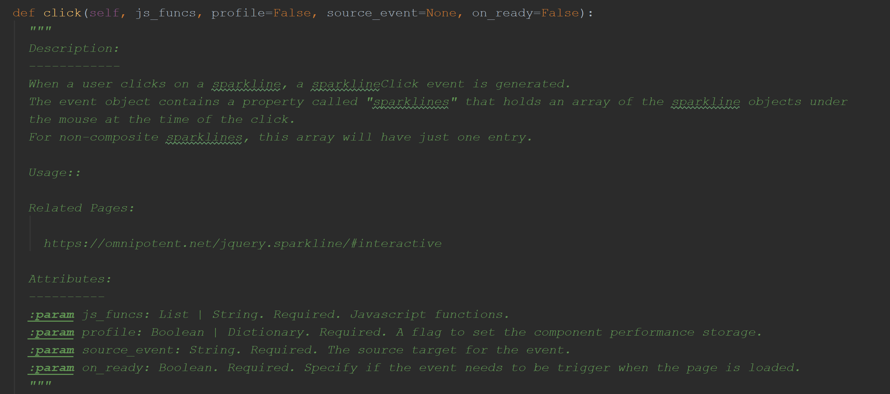
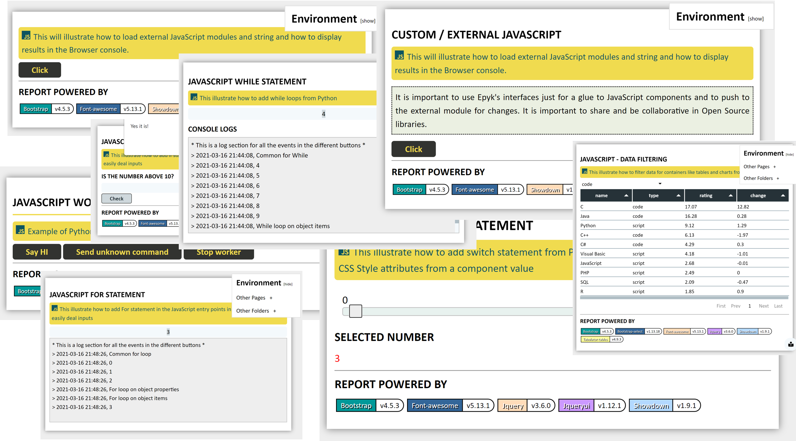
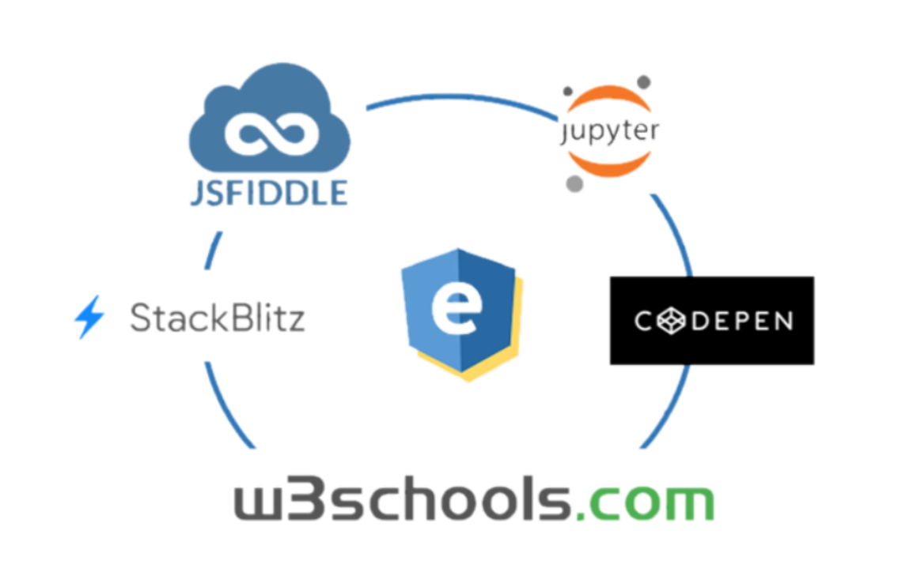
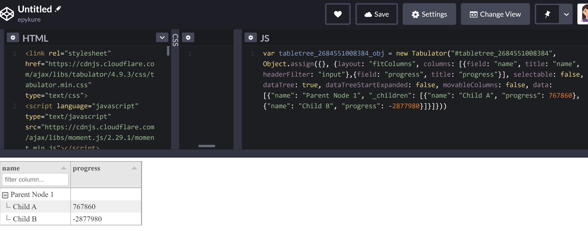

Epyk and full stack development
===============================

Documentation
*************

Epyk documentation will point you to the appropriate web concept.

The docstrings will link to either the online precised documentation or to the wrapped package.
Epyk's target is to make the link between Python and the web in a transparent manner.

Also components and entry points are structure to make sure you learn the various concepts of a web page. Thus
the keys words ``dom``, ``console.log``, ``InlineCss``, ``css properties``, ``page.bodt``, ``component.onReady()``
very popular in  web development will be familiar to you as well.

Those concept are illustrated in the local section of the `templates Github repo <https://github.com/epykure/epyk-templates/tree/master/locals>`_

Profiling
*********

Checking performances in important on the backend but also on the front end side.
Epyk will rely on the native features to profile the python and on the JavaScript side it will provide the profile keyword
to write log messages to the console (F12 in the browser)::

    def click(self, js_funcs, profile=None, source_event=None, on_ready=False):

Styles & Configuration
**********************

CSS Style
_________

It is possible to use CSS inline properties or bespoke CSS classes in order to change the display of components.
Quite a few examples are available but the easiest is to use ``style.css`` properties::

    button = page.ui.buttons.colored("Test")
    button.style.css.color = "yellow" # Change the text color
    button.style.css.position = "fixed"
    button.style.css.bottom = 10 # Default will use px
    button.style.css.right = 10 # Default will use px

More examples are available in the section :doc:`intro/extensions`

CSS effects
___________

It is also possible to use predefined CSS effects and animates::

    title2 = page.ui.titles.title("Epyk in few words", align="center")
    title2.style.effects.shiny_text("green")

    title1 = page.ui.titles.title("A vast selection of Charts", align="center")
    title1.style.effects.down(start=-10)

Interactivity & events
*********************

Component events
________________

Community
**********

Epyk is dedicated to be a bridge to JavaScript. Thus it will provide ways to share pieces of code in both worlds.
It is possible to structure your Python components and share them using Pyk files or to transpile a dashboard to then be
shared in the popular online editors.

**The purpose of this framework is to benefit from both worlds but also to contribute by providing feedbacks to the external libraries**

To Pyk
______

To Jupyter or JupyterLab
________________________

Epyk can be imported to any Notebook.
More details will come in this section.

To CodePen
__________

The below is a code generated using the codepen outs to illustrate a problem::

    import epyk as pk

    page = pk.Page()

    records = {"data": [
          {"name": 'Test', "_children": [
            {"name": 'AAAA', "progress": 767860},
            {"name": 'BBB', "progress": -2877980},
          ]}
        ], "columns": [
          {"title": "Task Name", "field": "name"},
          {"title": "Progress", "field": "progress"},
        ]}

    data = [
          {"name": 'Test', "_children": [
            {"name": 'AAAA', "progress": 767860},
            {"name": 'BBB', "progress": -2877980},
          ]}
        ]

    table = page.ui.tables.tabulators.hierarchy(data, cols=["name"], rows=["progress"], width=(300, 'px'))
    table.get_column("name").headerFilter = "input"
    page.outs.codepen()

`Codepend <https://codepen.io/epykure/pen/jOyXGZO>`_

To W3Try
________

