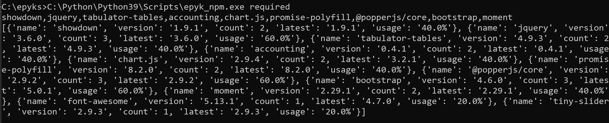

Security and Control
====================

Epyk is an open source platform allowing to display data transformed from Python modules thanks to the existing ecosystem.
For this reason the security and control of the packages used is really important.

Epyk will provide a full control on the stack used from the data retrieval to the final display in the page.

External libraries
******************

It is possible to restrict the list of packages or even to update / extend it.
Those packages have be tested to work with a dedicated version but it is quite easy to check if the latest version will
not put any regression to your page.

Offline mode
************

To speed up performances but also to run without internet connection on a server some features are available to
download the external packages. The folders structure created is the same one used by node.js to facilitate to migration
to other JavaScript or TypeScript web frameworks.

The property ``page.imports.requirements`` will allow to get the list of external packages used in the page.

**It is important to put this at the end as packages are added during the run when component are attached to the page**

Install packages
________________

It is possible to install a specific package or a list of packages using the below CLI. If the package is already install
the process will not try to update it::

    epyk_npm.exe install -pkg=promise-polyfill,@popperjs/core,bootstrap,showdown,jquery,accounting,tabulator-tables,moment,chart.js

Update packages
_______________

It is possible to update a specific package or a list of packages using the below CLI::

    epyk_npm.exe update -pkg=promise-polyfill,@popperjs/core,bootstrap,showdown,jquery,accounting,tabulator-tables,moment,chart.js

Install all packages
____________________

It is also possible to install all the packages (except the Google ones) used in the framework by using the follwoing CLI::

    epyk_npm.exe install_all

Restrict the scope
__________________

Change versions
_______________

Add packages
____________

Adding a new package means creating a new component.
It is very easy to add a new package by just using the importManager.

Add packages
____________

Checking packages and versions
______________________________

It is possible to check for a report or a list of reports the list of external packages.
This is quite useful to get a global view of the various dependencies but also it get information about the version of the
packages compared to the actual ones in `NPM <https://www.npmjs.com/>`_::

    ::C:\Python\Python39\Scripts\epyk_npm.exe required -r=epyk_page_0.py
    C:\Python\Python39\Scripts\epyk_npm.exe required

Google extensions
*****************

As google extensions are used to collect the information by default components using those modules are blocked.
It will require a specific line of code in order to enable them otherwise the transpilation will raise an error::

    # Enable Google Maps

    # By default all Google products are disabled
    page.imports.google_products(['maps'])

    map = page.ui.geo.google.terrain(-33.92, 151.25)

    # Click event to add interactivity on the page
    page.ui.button("Click").click([
      map.js.setMapTypeId('satellite'),
      map.js.setHeading(45),
    ])

