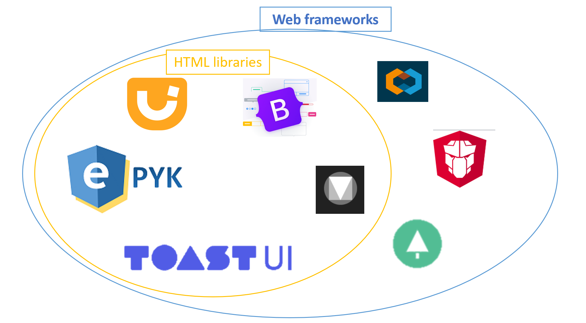

Web frameworks
==============

Multiple external web frameworks with predefined components are being integrated to Epyk.
It is possible to extend this list and to create your own wrapper to your preferred Web library. To do so please follow
the architecture guidelines: :doc:`../guides/add_another_web_framework`.

.. warning::
   This part of the framework is still work in progress so feel free to help.

Community
---------
This is a collaborative and open source framework so please do not hesitate to propose changes or extend the implementation
using PR. Code is fully available in `Github <https://github.com/epykure/epyk-ui/tree/master/epyk/fwk>`_ ! More details on the way to contribute using `PR <https://docs.github.com/en/github/collaborating-with-pull-requests/proposing-changes-to-your-work-with-pull-requests/creating-a-pull-request>`_

Jquery UI
---------

Jquery and Jquery UI are fully integrated to the core components. It means that those libraries will be added automatically
when they are needed by a component.

:doc:`../report/web/jqueryui`

`Official website <https://jqueryui.com//>`_

ToastUI
-------

Use TOAST UI to Make Your Web Delicious!.
JavaScript UI library and free open source project constantly managed by NHN.

:doc:`../report/web/toast`

`Official website <https://ui.toast.com//>`_

Bootstrap
---------

Build fast, responsive sites with Bootstrap
Quickly design and customize responsive mobile-first sites with Bootstrap, the world’s most popular front-end open
source toolkit, featuring Sass variables and mixins, responsive grid system, extensive prebuilt components,
and powerful JavaScript plugins.

:doc:`../report/web/bootstrap`

`Official website <https://getbootstrap.com/>`_

Material Design UI
------------------

Design. Create intuitive and beautiful products with Material Design.

:doc:`../report/web/material`

`Official website <https://material.io/design/>`_

Clarity
-------

Work in progress (depend on the Angular integration)

Evergreen
---------

Work in progress (depend on the Angular integration)

Common Interface
----------------

.. autoclass:: epyk.interfaces.Interface.WebComponents
  :members:
